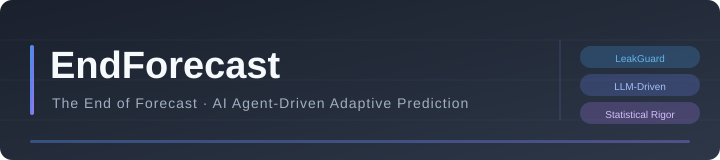

<p align="center">
  
</p>

<h2 align="center">The End of Forecast</h2>
<p align="center"><sub>Give it data. Get predictions. No tuning required.</sub></p>

<p align="center">
  <a href="https://www.python.org/downloads/"></a>
  <a href="LICENSE"></a>
  <br>
  <a href="README_CN.md">中文文档</a> ·
  <a href="#quick-start">Quick Start</a> ·
  <a href="#how-it-works">How It Works</a> ·
  <a href="#architecture">Architecture</a> ·
  <a href="#features">Features</a> ·
  <a href="METHODOLOGY.md">Methodology</a>
</p>

---

## What is EndForecast?

EndForecast automates the entire predictive modeling workflow — from raw data to a deployable predictor — using a formal 10-phase methodology grounded in CRISP-DM, Google's Rules of ML, and decades of forecasting best practice.

You provide data. It handles everything else.

```
from endforecast import EndForecast

ef = EndForecast()
result = ef.run("sales.csv", target_col="revenue",
                requirements="Predict next month's revenue")
result.export("code", output_dir="./forecast_app")   # → standalone predictor.py
```

---

## Quick Start

```bash
git clone https://github.com/endforecast/endforecast.git
cd endforecast && pip install -e .
```

```python
from endforecast import EndForecast

ef = EndForecast()

# Regression
result = ef.run("sales.csv", target_col="revenue")

# Time series with leak protection
result = ef.run(
    "prices.csv", target_col="price", time_col="date",
    leak_rules={"time_leak_protection": {"enabled": True, "cutoff_lag": "3d"}},
)

# Classification with heuristic rules
result = ef.run(
    "customers.csv", target_col="churn",
    heuristic_rules=["no login in 30 days → likely churned"],
)

# Deploy as standalone Python script
result.export("code", output_dir="./churn_predictor")
```

```bash
# CLI
endforecast run --data sales.csv --target revenue --time date
endforecast explore --data sales.csv
endforecast deploy --config config.json --mode tool --output ./my_tool
```

---

## How It Works

EndForecast runs a rigorous 10-phase pipeline. Every phase produces auditable, inspectable output — you can see exactly why a model was chosen, what alternatives were tested, and how confident the system is in its recommendation.

**Phase 0 — Understand the goal.** Before touching data: what to predict, what success looks like, what temporal constraints apply. Detects feedback-loop risks (predictions influencing future labels) and proxy-label traps (optimizing the wrong metric).

**Phase 1 — Understand the data.** Schema inference, distribution profiling, fingerprint extraction. Generates a structured natural-language diagnostic narrative (`"Strong seasonality (0.67). Recommend seasonal differencing."`) instead of isolated numbers. Detects label noise and cold-start groups.

**Phase 2 — Prepare the data.** Auto-plans imputation, scaling, encoding based on data quality findings.

**Phase 3 — Enforce temporal integrity.** Configurable LeakGuard runs user-defined rules (time boundaries, forbidden feature patterns, validation gaps) with runtime assertion probes. A single violation blocks the entire pipeline.

**Phase 4 — Establish baselines.** Mandatory baselines (naive, seasonal, linear) set a performance floor. If a baseline already meets the user's target: heuristic-first warning.

**Phase 5 — Experiment systematically.** Multi-round, cross-family trials with hyperparameter optimization (Round 2+), stability assessment across random seeds, and optimization-budget tracking (prevents unlimited data snooping).

**Phase 6 — Evaluate with rigor.** Multi-metric evaluation, paired t-tests with Bonferroni correction, effect sizes (Cohen's d), calibration assessment (ECE / Brier score), and data-snooping tax annotation.

**Phase 7 — Refine.** Statistical post-processing. Optional judgmental overrides with full audit trail.

**Phase 8 — Explain.** SHAP global + local explanations, permutation importance.

**Phase 9 — Deploy and record lineage.** Training data SHA256 hash, feature dependency list, pipeline ID. Auto-generates a [Model Card](https://arxiv.org/abs/1810.03993). Three-track export: JSON config, standalone Python module, or pip-installable CLI tool.

**Phase 10 — Monitor.** Data drift detection (KL divergence), performance degradation tracking, training-serving skew analysis on a per-feature basis, and data freshness scoring with refresh-frequency recommendations.

---

## Architecture

```
endforecast/
├── orchestrator.py            # 10-phase pipeline executor
├── config.py / cli.py / api.py   # Config, CLI, REST API
│
├── agents/                    # Intelligence layer
│   ├── requirements.py        # Phase 0: goal definition, risk detection
│   ├── explorer.py            # Phase 1: task detection, profiling, noise/hierarchy checks
│   ├── planner.py             # Phase 5: cross-family experiment design
│   ├── diagnostician.py       # Phase 7: failure pattern recognition
│   ├── refiner.py             # Phase 7: statistical + judgmental refinement
│   └── prompts.py             # LLM system prompts (task-agnostic)
│
├── engine/                    # Core computation
│   ├── pipeline.py            # Unified prediction pipeline
│   ├── leakguard.py           # Configurable temporal leak detection
│   ├── fingerprint.py         # Fingerprint + structured diagnostic narratives
│   ├── router.py              # Fast / standard / deep experiment routing
│   ├── trial.py               # Trial execution + optimization budget tracking
│   ├── baseline.py            # Task-adaptive baseline runner
│   ├── explainability.py      # SHAP + permutation importance
│   ├── drift.py               # Data/performance drift + training-serving skew
│   ├── label_noise.py         # Label noise detection (consistency + imbalance)
│   └── model_card.py          # Auto-generated model documentation
│
├── evaluation/                # Statistical toolkit
│   ├── splitter.py            # KFold, TimeSeriesSplit, NestedCV
│   ├── metrics.py             # 15+ metrics, t-tests, calibration, stability
│   └── hyperopt.py            # Grid, random, Bayesian optimization
│
├── models/                    # Model abstraction
│   ├── base.py                # Uniform fit / predict / cross_validate
│   └── registry.py            # @register_model decorator
│
└── deployment/                # Three-track export
    ├── pipeline_exporter.py   # JSON config + artifacts
    ├── code_generator.py      # Standalone predictor.py
    └── tool_generator.py      # pip-installable CLI tool
```

**34 modules. One entry point. Zero manual steps.**

---

## Features

### LeakGuard — Configurable Temporal Integrity

The single most dangerous error in predictive modeling is temporal leakage: accidentally training on data from after the prediction time. EndForecast is the only platform that treats leak detection as a first-class concern.

```python
from endforecast.engine import LeakGuard

guard = LeakGuard.from_config({
    "time_leak_protection": {
        "enabled": True, "cutoff_lag": "3d", "cutoff_time": "23:59:00",
    },
    "feature_crossing": {
        "enabled": True, "forbidden_patterns": ["y_lag1", "future_*"],
    },
})
report = guard.check("2024-06-15", training_df)
assert report.all_clear  # or inspect report.summary()
```

### Heuristic First

Per Google's Rules of ML: deploy heuristics before machine learning. If a simple baseline already meets your performance target, EndForecast will tell you — before wasting compute on complex models.

### Statistical Rigor, Not Just Numbers

Every model comparison reports paired t-tests with Bonferroni correction, effect sizes (Cohen's d), and multi-seed stability (± standard deviation). A model that varies by 5% across random seeds is fundamentally different from one that's consistent within 0.1%.

### Training-Serving Skew Detection

Catches the most dangerous class of production ML bugs: features changing silently between training and serving time. Missing-rate spikes, mean shifts exceeding 2σ, and range violations are flagged per-feature with severity levels.

### Model Lineage + Auto-Generated Model Cards

Every deployed model carries a complete provenance record (training data hash, feature list, date range, pipeline ID). A Model Card is auto-generated following Google's format — a compliance necessity for regulated industries.

### Three-Track Deployment

| Track | Output | Best For |
|-------|--------|----------|
| `config` | `config.json` + binary artifacts | In-platform reuse |
| `code` | Standalone `predictor.py` | Independent Python deployment |
| `tool` | `pip install`-able CLI package | CI/CD, non-Python environments |

### Detection Framework

EndForecast automatically scans for common prediction failure modes early in the pipeline:

| Detection | Phase | What It Catches |
|-----------|-------|-----------------|
| Temporal leakage | 3 | Time boundaries, feature crossing, label contamination |
| Feedback loops | 0 | Predictions that influence future labels |
| Proxy label traps | 0 | Optimizing the wrong metric |
| Label noise | 1 | Inconsistent or suspiciously imbalanced labels |
| Cold start | 1 | Groups with too few samples for reliable prediction |
| Data snooping | 6 | Over-optimistic validation scores from repeated tuning |
| Training-serving skew | 10 | Silent feature drift in production |
| Data staleness | 10 | How long since the model was last trained on fresh data |

---

## Supported Tasks

| Task | Models | Metrics |
|------|--------|---------|
| **Classification** | Logistic, LightGBM, XGBoost, RandomForest | F1, AUC, Accuracy, Precision/Recall, ECE |
| **Regression** | Ridge, LightGBM, XGBoost, RandomForest | MAE, MAPE, RMSE, R² |
| **Time Series** | Ridge, LightGBM, XGBoost, RandomForest | MASE, SMAPE, Directional Accuracy |

All models follow a uniform `fit / predict / cross_validate` interface. Custom models can be added via `@register_model`.

### Why Tree-Based and Linear Models Only?

EndForecast ships with lightweight, sklearn-compatible models by default: no PyTorch, no TensorFlow, no CUDA. This is an intentional design choice:

**Minimal footprint.** The core engine is pure Python + scikit-learn. No multi-gigabyte GPU dependencies. You can run it on a laptop, a CI runner, or a headless server without any special hardware.

**Predictability.** Tree and linear models are deterministic and fast. Deep learning adds non-determinism (GPU floating-point variance across runs), which undermines the statistical rigor EndForecast is built on — stability across random seeds is meaningless if the same seed produces different results on different hardware.

**You control what goes in.** EndForecast's model registry is a framework, not a catalog. You can add any model — deep learning, foundation models, proprietary in-house models — through a single decorator. The platform doesn't need to know or ship what you use.

### Adding Custom Models (Private, Deep Learning, or Foundation Models)

Register any sklearn-compatible model, a PyTorch/TensorFlow wrapper, or a private API client with one decorator:

```python
from endforecast.models import register_model, BaseModel
import joblib

# Private in-house model
@register_model("my_proprietary_model")
class MyModel(BaseModel):
    def _fit_impl(self, X, y, **kw):
        model = joblib.load("/internal/models/prod_v3.pkl")
        return model.fit(X, y)

    def _predict_impl(self, X, **kw):
        return self._model.predict(X)


# Deep learning (PyTorch)
@register_model("deepar")
class DeepARWrapper(BaseModel):
    def _fit_impl(self, X, y, **kw):
        import torch
        # your training logic
        ...
    def _predict_impl(self, X, **kw):
        ...


# Foundation model (TimesFM, Chronos, etc.)
@register_model("timesfm")
class TimesFMWrapper(BaseModel):
    def _fit_impl(self, X, y, **kw):
        import timesfm
        self._model = timesfm.TimesFm(...)
        ...
    def _predict_impl(self, X, **kw):
        ...
```

Once registered, your model appears in the planner's candidate pool and is evaluated alongside all others in every experiment round — exactly like the built-in models.

---

## Without LLM

The engine, evaluation, and deployment layers run without any LLM dependency. The agent layer (explorer, planner, diagnostician, refiner) uses LLM prompts but is optional — all 10 phases operate in deterministic mode when no LLM is configured.

| Layer | LLM Required? |
|-------|:---:|
| Pipeline engine, LeakGuard, Fingerprint, Label Noise | No |
| Baseline runner, Experiment router, Drift detection | No |
| Data splitter, Metric calculator, Statistical tests | No |
| HPO (grid/random/Bayesian), Stability evaluator | No |
| SHAP explainer, Drift detector, Model Card generator | No |
| Code/tool/pipeline exporter | No |
| Agent prompts (explorer, planner, diagnostician, refiner) | Yes |

---

## Methodology

EndForecast implements a methodology grounded in:

- **CRISP-DM** — the dominant industry data mining framework (6 phases, 4× more adoption than alternatives)
- **Google's Rules of ML** — heuristic-first design, training-serving skew prevention, feature engineering from domain knowledge
- **Hyndman's Forecasting Workflow** — graphical exploration, benchmark methods, progressive model complexity
- **M-Competition Lessons** — hybrid approaches outperform pure methods; ensemble diversity over hyperparameter tuning

Full document: [METHODOLOGY.md](METHODOLOGY.md)

---

## License

Apache 2.0. See [LICENSE](LICENSE).

---

<p align="center">
  <sub>Built with statistical rigor. <b>The End of Forecast.</b></sub>
</p>