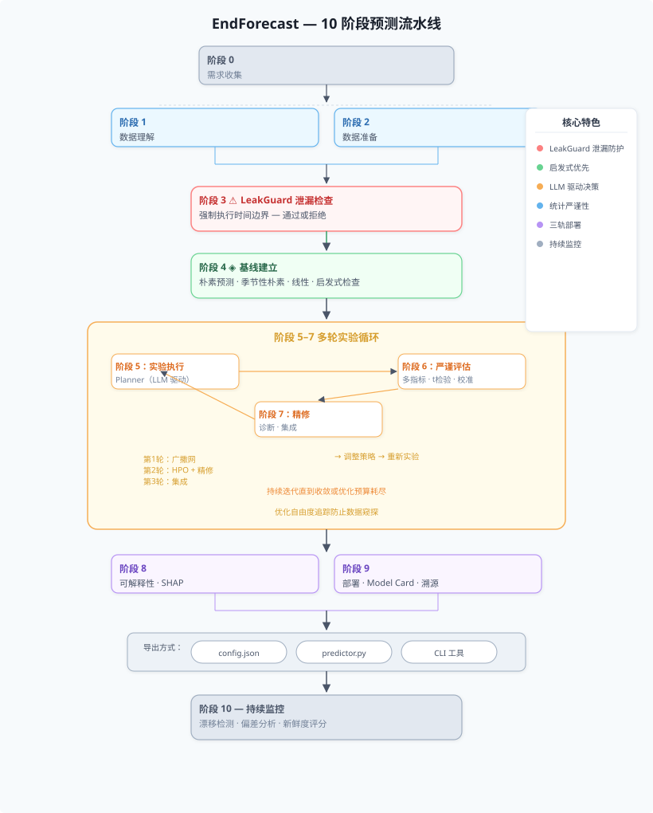

<h2 align="center">The End of Forecast — 预测的终点</h2>
<p align="center"><sub>给它数据，拿到预测，无需调参。</sub></p>

<p align="center">
  <a href="https://www.python.org/downloads/"></a>
  <a href="LICENSE"></a>
  <br>
  <a href="README.md">English</a> ·
  <a href="#快速开始">快速开始</a> ·
  <a href="#工作流程">工作流程</a> ·
  <a href="#架构">架构</a> ·
  <a href="#核心能力">核心能力</a> ·
  <a href="METHODOLOGY.md">方法论</a>
</p>

---

## EndForecast 是什么？

EndForecast 将完整的预测建模工作流自动化——从原始数据到可部署的预测器——基于一个融合了 CRISP-DM、Google Rules of ML 和数十年预测领域最佳实践的 10 阶段方法论。

你提供数据，其余全部自动化。

```python
from endforecast import EndForecast

ef = EndForecast()
result = ef.run("sales.csv", target_col="revenue",
                requirements="预测下个月营收")
result.export("code", output_dir="./forecast_app")   # → 生成独立 predictor.py
```

---

## 快速开始

```bash
git clone https://github.com/endforecast/endforecast.git
cd endforecast && pip install -e .
```

```python
from endforecast import EndForecast

ef = EndForecast()

# 回归
result = ef.run("sales.csv", target_col="revenue")

# 时序 + 泄漏防护
result = ef.run(
    "prices.csv", target_col="price", time_col="date",
    leak_rules={"time_leak_protection": {"enabled": True, "cutoff_lag": "3d"}},
)

# 分类 + 启发式规则
result = ef.run(
    "customers.csv", target_col="churn",
    heuristic_rules=["30 天未登录 → 可能流失"],
)

# 部署为独立的 Python 脚本
result.export("code", output_dir="./churn_predictor")
```

```bash
# CLI
endforecast run --data sales.csv --target revenue --time date
endforecast explore --data sales.csv
endforecast deploy --config config.json --mode tool --output ./my_tool
```

---

## 工作流程

EndForecast 执行一个严谨的 10 阶段流程，每个阶段都产出可审计、可回溯的输出。你能确切地知道为什么选了某个模型、测试过哪些替代方案、系统对结论有多大把握。

<p align="center">
  
</p>

**阶段 0 — 理解目标。** 接触数据之前先弄清：预测什么、成功标准是什么、有哪些时间约束。检测反馈循环风险（预测结果反过来影响未来的训练标签）和代理标签陷阱（优化了错误的指标而非真正的业务目标）。

**阶段 1 — 理解数据。** Schema 推断、分布画像、特征指纹提取。生成结构化的自然语言诊断描述——例如"强季节性(0.67)，建议使用季节性差分"——而非孤立数值。同时检测标签噪声和冷启动分组。

**阶段 2 — 准备数据。** 基于数据质量发现，自动规划缺失值处理、缩放、编码方案。

**阶段 3 — 强制时间完整性。** 可配置的 LeakGuard 执行用户定义的泄漏规则（时间边界、禁止特征模式、验证集间隔），每次实验循环中由运行时断言探针校验。一次违规即阻止整个流程。

**阶段 4 — 建立基线。** 强制基线（朴素预测、季节性朴素、线性模型）设定性能底线。如果基线已满足用户目标，发出"启发式已足够"警告。

**阶段 5 — 系统性实验。** 实验开始前，一次 LLM 调用（*实验配置器*）决定全部实验参数：holdout 方法及比例、交叉验证策略、执行路由、试验数量、超参数优化方法、主评估指标——替代了原本散布在 orchestrator、splitter、router、planner 中的 ~8 个硬编码分支。配置完成后，Planner 智能体读取特征指纹诊断文本，根据每份数据的具体情况自主选择模型、特征组合和预处理策略（无硬编码模型列表）。特征工程由命名约定解析器驱动：LLM 自由命名任何特征（`lag_24`、`diff_lag_1`、`rolling_mean_7`、`ema_12`、`hour`、`is_weekend`…），引擎自动计算。未配置 LLM 时降级为合理的默认方案。跨模型族的多轮实验：第二轮起启用超参数优化、多种子稳定性评估、优化自由度追踪。最佳模型选择支持方向感知（F1/AUC 最大化，MAE/MASE 最小化）。

**阶段 6 — 严谨评估。** 多指标评估，配对 t 检验与 Bonferroni 校正，效应量（Cohen's d），校准评估（ECE / Brier Score）。Holdout 评估：完全未被实验触及的数据切片（时序数据按时间顺序切尾部、分类数据分层抽样、回归数据随机切分）提供唯一无偏的性能估计。无数据窥探：实验过程中从未见过 holdout。

**阶段 7 — 精修。** LLM 驱动的精修：Refiner 智能体基于误差分析自主选择后处理方法（残差校正、阈值优化或统计裁剪）。未配置 LLM 时默认使用统计精修。可选的人工判断覆盖，附带完整审计记录。支持集成策略（中位数集成、逆 MASE 加权、Stacking）用于后续轮次的多模型组合。

**阶段 8 — 解释。** SHAP 全局 + 局部解释，排列特征重要性。

**阶段 9 — 部署与溯源记录。** 训练数据 SHA256 哈希、特征依赖清单、Pipeline ID。自动生成 Model Card。三轨导出：JSON 配置、独立 Python 模块、可 pip 安装的 CLI 工具。

**阶段 10 — 监控。** 数据漂移检测（KL 散度）、性能退化追踪、逐特征训练-服务偏差分析、数据新鲜度评分与刷新频率建议。

---

## 架构

```
endforecast/
├── orchestrator.py            # 10 阶段流程执行器
├── config.py / cli.py / api.py   # 配置、命令行、REST API
│
├── agents/                    # LLM 决策层（均有确定性 fallback）
│   ├── requirements.py        # 阶段 0：目标定义、风险检测
│   ├── explorer.py            # 阶段 1：任务识别、数据画像、噪声/层级检查
│   ├── planner.py             # 阶段 5：LLM 驱动的模型/特征/预处理设计
│   ├── diagnostician.py       # 阶段 5：LLM 驱动的逐轮失败分析
│   ├── refiner.py             # 阶段 7：统计精修 + 人工判断覆盖
│   └── prompts.py             # 8 个 LLM 系统提示词（配置器、Planner、诊断器、
│                              #   精修器、集成、模型选择、探索器、评估器）
│
├── engine/                    # 核心计算（确定性函数）
│   ├── pipeline.py            # 统一预测流水线
│   ├── leakguard.py           # 可配置的时序泄漏检测
│   ├── fingerprint.py         # 特征指纹 + 结构化诊断描述
│   ├── router.py              # 快速 / 标准 / 深度实验路由
│   ├── trial.py               # 试验执行 + 优化自由度追踪
│   ├── baseline.py            # 任务自适应的基线执行器
│   ├── explainability.py      # SHAP + 排列重要性
│   ├── drift.py               # 数据/性能漂移 + 训练服务偏差
│   ├── label_noise.py         # 标签噪声检测（一致性 + 不平衡）
│   └── model_card.py          # 自动生成的模型文档
│
├── evaluation/                # 统计工具集
│   ├── splitter.py            # KFold、TimeSeriesSplit、NestedCV
│   ├── metrics.py             # 15+ 指标、统计检验、校准、稳定性
│   └── hyperopt.py            # 网格、随机、贝叶斯优化
│
├── models/                    # 模型抽象层
│   ├── base.py                # 统一的 fit / predict / cross_validate 接口
│   └── registry.py            # @register_model 装饰器注册
│
└── deployment/                # 三轨导出
    ├── pipeline_exporter.py   # JSON 配置 + 产物文件
    ├── code_generator.py      # 独立 predictor.py
    └── tool_generator.py      # pip 可安装的 CLI 工具
```

**36 个模块，单一入口，零手工步骤。**

---

## 核心能力

### LeakGuard — 可配置的时间完整性防护

预测建模中最危险的错误是时间泄漏：意外地用到了预测时刻之后的数据进行训练。

```python
from endforecast.engine import LeakGuard

guard = LeakGuard.from_config({
    "time_leak_protection": {
        "enabled": True, "cutoff_lag": "3d", "cutoff_time": "23:59:00",
    },
    "feature_crossing": {
        "enabled": True, "forbidden_patterns": ["y_lag1", "future_*"],
    },
})
report = guard.check("2024-06-15", training_df)
assert report.all_clear  # 或调用 report.summary() 查看详情
```

### 启发式优先

遵循 Google Rules of ML：先用启发式规则，再考虑机器学习。如果简单基线已达标，EndForecast 会在浪费算力之前告诉你。

### 统计严谨性

每次模型比较都附带配对 t 检验（Bonferroni 校正）、效应量（Cohen's d）、多种子稳定性（均值 ± 标准差）。同一模型跨种子波动 5% 与波动 0.1% 有本质区别。

### 训练-服务偏差检测

捕获生产环境中最危险的一类 ML bug：特征在训练时和服务时悄然变化——缺失率飙升、均值偏移超过 2σ、值域越界——按特征逐项标记，带严重度分级。

### 模型溯源 + 自动生成的 Model Card

每个部署的模型都带有完整的溯源记录（训练数据哈希、特征列表、日期范围、Pipeline ID），Model Card 按 Google 格式自动生成，满足受监管行业的合规需求。

### 三轨部署

| 轨道 | 产物 | 适用场景 |
|------|------|---------|
| `config` | `config.json` + 二进制产物 | 平台内复用 |
| `code` | 独立的 `predictor.py` | 独立 Python 部署 |
| `tool` | `pip install` 可安装 CLI 包 | CI/CD、非 Python 环境 |

### 检测框架

EndForecast 在流程的早期阶段自动扫描常见的预测失败模式：

| 检测项 | 阶段 | 检测什么 |
|--------|------|---------|
| 时间泄漏 | 3 | 时间边界、特征穿越、标签污染 |
| 反馈循环 | 0 | 预测结果会反过来影响未来训练数据 |
| 代理标签陷阱 | 0 | 优化了错误的指标而非真正的业务目标 |
| 标签噪声 | 1 | 不一致或可疑失衡的训练标签 |
| 冷启动 | 1 | 样本太少无法可靠预测的数据分组 |
| 数据窥探 | 6 | 反复调参导致的过度乐观验证分数 |
| 训练-服务偏差 | 10 | 生产环境中特征的悄然漂移 |
| 数据过期 | 10 | 模型距离上次在新鲜数据上训练的天数 |

---

## 支持的任务类型

| 任务 | 模型 | 指标 |
|------|------|------|
| **分类** | Logistic、LightGBM、XGBoost、RandomForest | F1、AUC、Accuracy、Precision/Recall、ECE |
| **回归** | Ridge、LightGBM、XGBoost、RandomForest | MAE、MAPE、RMSE、R² |
| **时序** | Ridge、LightGBM、XGBoost、RandomForest | MASE、SMAPE、方向准确率 |

所有模型遵循统一的 `fit / predict / cross_validate` 接口。可通过 `@register_model` 添加自定义模型。

### 为什么默认只有树模型和线性模型？

EndForecast 出厂只带轻量级、sklearn 兼容的模型，无需 PyTorch、TensorFlow 或 CUDA。这是有意为之的设计选择：

**极简安装。** 核心引擎是纯 Python + scikit-learn，无 GB 级 GPU 依赖，可在笔记本、CI 运行器或无 GPU 服务器上运行。

**确定性。** 树模型和线性模型是确定性的、快速的。深度学习依赖 GPU 浮点精度，同一 seed 在不同硬件上产生不同结果，直接破坏跨种子稳定性评估的意义。

**你控制什么进去。** 模型注册中心是一个框架而非目录。通过一行装饰器即可注入任何模型——深度学习、基础模型、私有内部模型——平台不需要知道或打包你使用的东西。

### 添加自定义模型（私有模型、深度学习或基础模型）

```python
from endforecast.models import register_model, BaseModel
import joblib

# 私有的内部模型
@register_model("my_proprietary_model")
class MyModel(BaseModel):
    def _fit_impl(self, X, y, **kw):
        model = joblib.load("/internal/models/prod_v3.pkl")
        return model.fit(X, y)

    def _predict_impl(self, X, **kw):
        return self._model.predict(X)


# 深度学习模型（PyTorch）
@register_model("deepar")
class DeepARWrapper(BaseModel):
    def _fit_impl(self, X, y, **kw):
        import torch
        # 你的训练逻辑
        ...
    def _predict_impl(self, X, **kw):
        ...


# 基础模型（TimesFM、Chronos 等）
@register_model("timesfm")
class TimesFMWrapper(BaseModel):
    def _fit_impl(self, X, y, **kw):
        import timesfm
        self._model = timesfm.TimesFm(...)
        ...
    def _predict_impl(self, X, **kw):
        ...
```

注册后，你的模型会自动出现在规划器的候选池中，在每一轮实验中与内置模型同等评估。

---

## 不使用 LLM 的运行方式

引擎层、评估层和部署层无需任何 LLM 依赖。智能体层使用 LLM 提示词但完全可选——未配置 LLM 时，所有 10 个阶段以确定性 fallback 模式运行。

| 层级 | 需要 LLM？ |
|------|:---:|
| Pipeline 引擎、LeakGuard、Fingerprint、Label Noise | 否 |
| Baseline 执行器、实验路由器、漂移检测 | 否 |
| 数据分割器、指标计算器、统计检验 | 否 |
| HPO（网格/随机/贝叶斯）、稳定性评估器 | 否 |
| SHAP 解释器、Model Card 生成器 | 否 |
| 代码/工具/Pipeline 导出器 | 否 |
| Agent 提示词（planner、diagnostician、refiner） | 是（可选） |

---

## 方法论

EndForecast 实现的方法论源于：

- **CRISP-DM** — 主流行业数据挖掘框架（6 阶段，采用率远超其他方案）
- **Google Rules of ML** — 启发式优先设计、训练-服务偏差防护、从领域知识构造特征
- **Hyndman 预测工作流** — 图形探索优先、基准方法、渐进式模型复杂度
- **M 竞赛经验** — 混合方法优于单一方法；集成多样性优于超参数调优

完整文档：[METHODOLOGY.md](METHODOLOGY.md)

---

## License

Apache 2.0。详见 [LICENSE](LICENSE)。

---

<p align="center">
  <sub>以统计严谨性构建 · <b>预测的终点</b></sub>
</p>